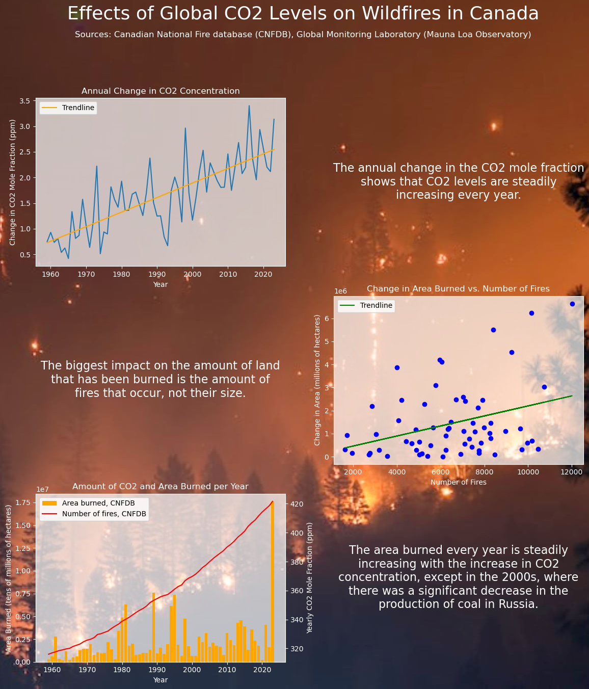

# ENDG 310 - Lab2
### Catherine McLellan

Analyzing global CO2 data and Canadian forest fire data utilizing datasets from the Government of Canada and from the U.S. National Oceanic and Atmospheric Administration.

## Summary
With the consistent increase in the CO2 concentration every year, it is shown that the number of forest fires and area burned is also rising, except in a few cases such as the early 2000s and 2020. There was a global shutdown in 2020 due to the pandemic which led to the highest decrease in CO2 emissions in the last century. In the late 1990s - 2009, there was a global crisis in which the production of coal in Russia was significantly decreased. Both of these cases prove that the fires occuring are directly linked to the global CO2 emissions.

## Instructions for Downloading the Data Files:
Click on the direct links to download the files listed below:
* [Mauna Loa CO2 monthly mean data (text)](https://gml.noaa.gov/webdata/ccgg/trends/co2/co2_mm_mlo.csv)
* [National Fire Database fire point data – Summary Stats](https://cwfis.cfs.nrcan.gc.ca/downloads/nfdb/fire_pnt/current_version/NFDB_point_stats.zip)\
Note: you will need to unzip the National Fire Database fire point data

Additional data for the years 2022 and 2023 were pulled from the [Current and Archived National Wildland Fire Situation Reports](https://cwfis.cfs.nrcan.gc.ca/report)

Add the files to a folder called "Data" and add it to this repository.

